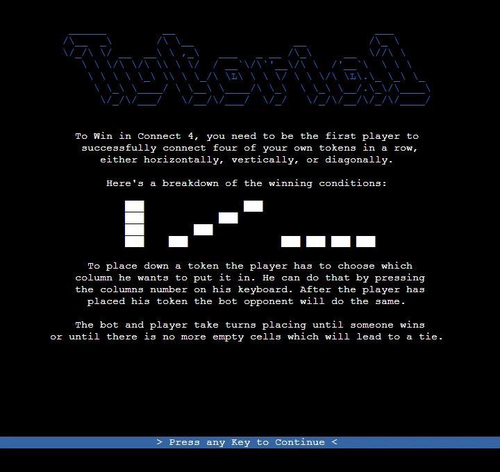
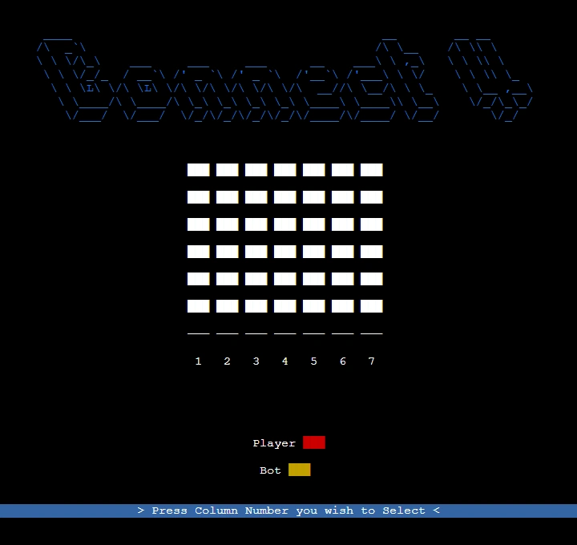

# Connect4 Terminal Game

Terminal Connect4 is a Python implementation of the classic game Connect4, designed to be played in the terminal. This project allows you to enjoy the popular two-player game against a bot opponent, providing a challenging and interactive experience right from your command line.

You can find the live Demo here! - https://terminal-connect4.herokuapp.com/

- [Connect4 Terminal Game](#connect4-terminal-game)
  * [Features](#features)
    * [Existing Features](#existing-features)
    * [Features Left to Implement](#features-left-to-implement)
  * [Data Model](#data-model)
  * [Testing](#testing)
    * [Unfixed Bugs](#unfixed-bugs)
    * [Validator Testing](#validator-testing)
  * [Deployment](#deployment)
  * [Development](#development)
    * [Technologies Used](#technologies-used)
    * [External Python Packages Used](#external-python-packages-used)
  * [Credits](#credits)
    * [Content](#content)
    * [Media](#media)

## Features

### Existing Features

  - Terminal User Interface
    - A terminal was used as a means to display the state of the game and allow users to interact with it.
    - To improve user experience the terminal app library [blessed](https://pypi.org/project/blessed/) was used which allowed for better visuals and easier input handling.
    - To allow for a easier and more modular way of displaying the state of a [Game](https://github.com/DebuggedMoon/terminal-connect4/blob/main/game.py), the [TerminalGame](https://github.com/DebuggedMoon/terminal-connect4/blob/main/terminalgame.py) class was written to handle everything Terminal and [blessed](https://pypi.org/project/blessed/) related.
    - The Terminal UI controls and switches between a number of screens to achieve more of a video game feeling:
      - The `Starting Screen` welcomes players and gives a short and hyped summary of the game.
        
      - The `Tutorial Screen` gives the player information about the game and teaches them on how to play it.
        
      - The `Game Screen` displays the playfield of the game and gives the user feedback for his input.
        

## Testing

### Validator Testing 
 - Pylint was used with for validating the python files. All python files were checked and no warnings were found!
## Deployment
The application was deployed on [Heroku](https://dashboard.heroku.com/). The Code Institude provided [Template](https://github.com/Code-Institute-Org/python-essentials-template) was used to host the python terminal on a web app allowing users to demo it in the browser.

Deployment steps are as follows, after account setup:

Select New in the top-right corner of your Heroku Dashboard, and select Create new app from the dropdown menu.
Your app name must be unique, and then choose a region closest to you (EU or USA), and finally, select Create App.
From the new app Settings, click Reveal Config Vars, and set the value of KEY to PORT, and the value to 8000 then select add.
Further down, to support dependencies, select Add Buildpack.
The order of the buildpacks is important, select Python first, then Node.js second. (if they are not in this order, you can drag them to rearrange them)
Heroku needs two additional files in order to deploy properly.

requirements.txt
Procfile
You can install this project's requirements (where applicable) using: pip3 install -r requirements.txt. If you have your own packages that have been installed, then the requirements file needs updated using: pip3 freeze --local > requirements.txt

The Procfile can be created with the following command: echo web: node index.js > Procfile

For Heroku deployment, follow these steps to connect your GitHub repository to the newly created app:

In the Terminal/CLI, connect to Heroku using this command: heroku login -i
Set the remote for Heroku: heroku git:remote -a <app_name> (replace app_name with your app, without the angle-brackets)
After performing the standard Git add, commit, and push to GitHub, you can now type: git push heroku main
The frontend terminal should now be connected and deployed to Heroku.

## Development

### External Python Packages Used

 - [blessed](https://pypi.org/project/blessed/) was used to allow for easier creation of the application and input handling.

## Credits

### Content

 - The idea to use blessed was inspiried by [Eoin](https://github.com/eoinlarkin).